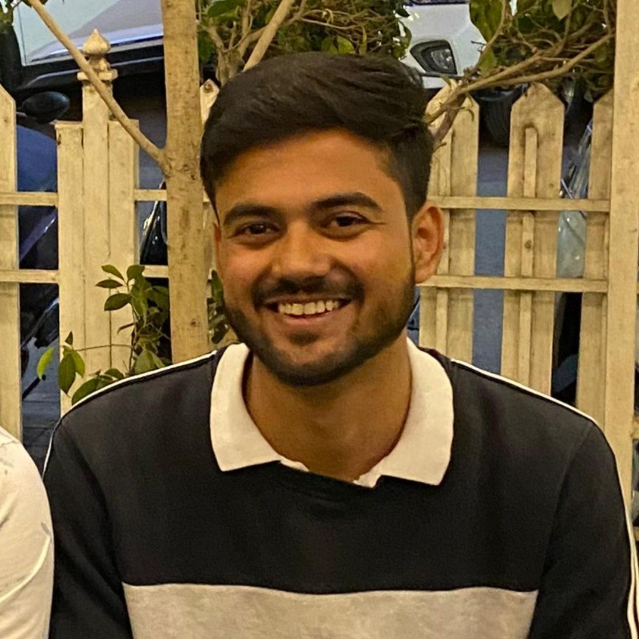

<!-- Sidebar Profile Section -->

**Dhanhanjay Pachori**  
Undergraduate Student  
Indian Institute of Information Technology, Nagpur  

📧 [bt22ece024@iiitn.ac.in](mailto:bt22ece024@iiitn.ac.in)  
📱 +91-8871117057  
🔗 [Google Scholar](https://scholar.google.com/citations?user=MUerymUAAAAJ&hl=en&oi=ao)  
🔗 [LinkedIn](https://linkedin.com/in/dhanhanjay-pachori/)  
🔗 [ORCID](https://orcid.org/0009-0004-9748-604X)

---

## 📚 Table of Contents

- [🎓 Education](#education)
- [💼 Research Experience](#research-experience)
- [📄 Publications](#publications)
- [🧠 Workshops & Courses](#workshops--courses)
- [🏅 Leadership & Responsibilities](#leadership--responsibilities)
- [📬 References](#references)

---

## 🎓 Education

### Bachelor of Technology (B.Tech.) in Electronics and Communication Engineering  
**Indian Institute of Information Technology, Nagpur**  
_November 2022 – Present_  
**CGPA**: 8.78 (Till Semester V)

**Relevant Coursework**:  
Signals and Systems, Digital Signal Processing, Analog Communication, Digital Communication, Optical Communication, Wireless Communication, Digital Electronics, Electronic Devices and Circuits

---

## 💼 Research Experience

### Research Intern – University of California, Irvine, United States  
_February 2025 – Present_  
- **Project**: Virtuality-Ecotone-Reality Merging for Localization using Microtechnology  
- **Supervisor**: Prof. Andrei Shkel

### Research Intern – National Autonomous University of Mexico (UNAM), Mexico  
_December 2024 – February 2025_  
- **Topic**: EEG Signal Analysis via MVMD for Mobile BCI  
- **Supervisor**: Dr. Mario Arrieta Paternina

### Research Intern – Indian Institute of Technology Palakkad  
_September 2024 – December 2024_  
- **Topic**: Respiration Rate Estimation from ECG  
- **Supervisor**: Dr. M. Sabarimalai Manikandan

### Research Intern – Indian Institute of Technology Delhi  
_May 2024 – July 2024_  
- **Topic**: Human Emotion Recognition using EEG  
- **Supervisor**: Prof. Tapan Kumar Gandhi

### Research Intern – Indian Institute of Science, Bangalore  
_December 2023 – February 2024_  
- **Topic**: Vibration Detection in Speech  
- **Supervisor**: Dr. Prasanta Kumar Ghosh

### Research Intern – Raja Ramanna Centre for Advanced Technology  
_July 2023_  
- **Topic**: Optical Fiber-Based Distributed Temperature Sensor  
- **Supervisor**: Dr. Manoj Kumar Saxena

### Research Intern – Indian Institute of Technology Indore  
_March 2023 – May 2023_  
- **Topic**: AI, ML, and Deep Learning Applications  
- **Supervisor**: Prof. Vimal Bhatia

---

## 📄 Publications

### 📘 Book Chapters
1. *Introduction to Cardiovascular Signals and Automated Systems*  
   Elsevier, 2024. [DOI](https://doi.org/10.1016/B978-0-44-314141-6.00006-2)

2. *PPG-Based Diagnosis System for Cardiovascular Disorders*  
   Elsevier, 2025. [In Press]

### 📝 Journal Papers
1. *FBSE-Based Approach for Discriminating Seizure and Normal EEG Signals*, IEEE Sensors Letters, 2024  
   [DOI](https://doi.org/10.1109/LSENS.2024.3493253)

2. *Automated Emotion Recognition using TQWT-EEG Subbands*, IEEE Sensors Letters, 2024  
   [DOI](https://doi.org/10.1109/LSENS.2024.3486708)

3. *Detection of Atrial Fibrillation from PPG via VMD*, IEEE Sensors Letters, 2024  
   [DOI](https://doi.org/10.1109/LSENS.2024.3358589)

4. *FBSE-EWT Based Parkinson’s Detection (Speech)*, IEEE Transactions on Human-Machine Systems, 2025  
   _[Under Review]_

### 🎤 Conference Papers
- *EEG-Based Emotion Detection using Wavelet Banks*, ICCCNT 2024, IIT Mandi  
- *Snoring Detection via Synchrosqueezed Wavelet Transform*, ICSC 2025, JIIT Noida  
- *Snoring Classification using Superlet Transform*, ICSC 2025, JIIT Noida  
- *SVM-Based Fire Signal Detection in Raman OFDR*, NLS-32, 2024 (_Best Poster_)  
- *EEG-Based Envisioned Speech Recognition*, EUSIPCO 2025, Palermo, Italy (_Accepted_)

---

## 🧠 Workshops & Courses

- Reinforcement Learning Workshop, IISc Bangalore – Jan 2025  
- SP & ML for Medical Applications, IIT Indore – Jun 2024  
- Smart Health Monitoring Workshop, IIT Indore – Nov 2023  
- ML in Urban Studies, ISRO – Jun 2023  
- Time-Frequency Signal Processing, IIT Indore – Jan 2023  
- IEEE CIS Summer Schools (IIT Indore, MNIT Jaipur, NIT Arunachal) – 2022–23

---

## 🏅 Leadership & Responsibilities

- **AI/ML Lead**, Google Developer Groups – IIIT Nagpur (2024 – Present)  
- **Mentor**, Elevate Dev Wing – IIIT Nagpur (2024 – Present)  
- **Networking Lead**, Placement Cell – IIIT Nagpur (2024 – Present)  
- **Core Team – AI/ML**, GDSC – IIIT Nagpur (2023 – 2024)  
- **Club Head**, Elevate Dev Wing – IIIT Nagpur (2023 – 2024)  
- **Core Team – Hospitality**, Tantrafiestra Fest – IIIT Nagpur (2023 – 2024)

---

## 📬 References

**Prof. Tapan Kumar Gandhi**  
_IIT Delhi_ — tgandhi@iitd.ac.in

**Prof. M. Sabarimalai Manikandan**  
_IIT Palakkad_ — msm@iitpkd.ac.in

**Prof. Rajesh Kumar Tripathy**  
_BITS Pilani (Hyderabad)_ — tripathyrk@hyderabad.bits-pilani.ac.in

---

_Last updated: June 2025_
